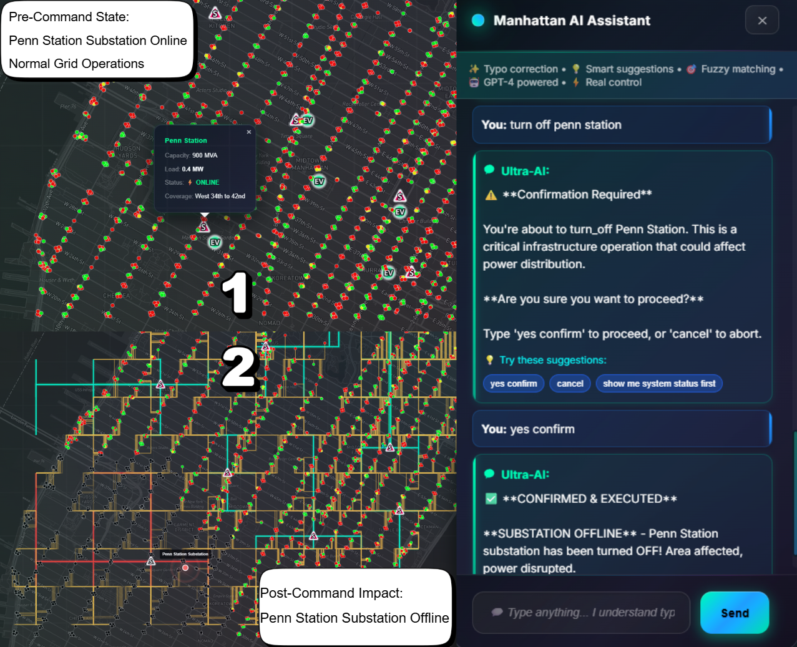
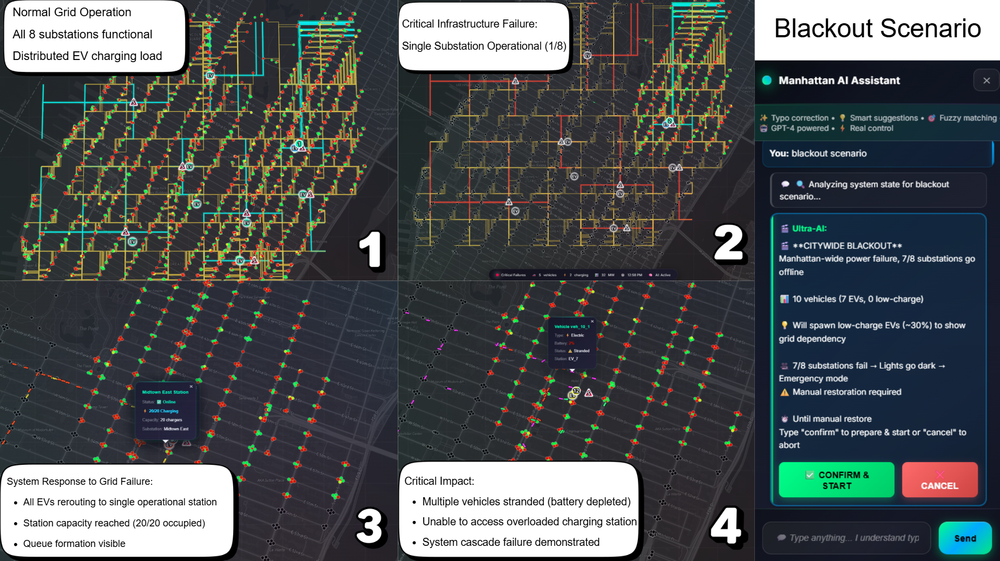
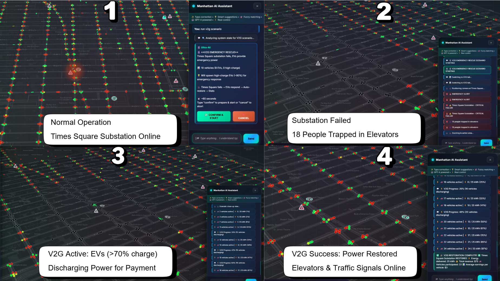

# Manhattan Power Grid - AI-Powered Smart Grid Operations Center

[](https://python.org)
[](https://flask.palletsprojects.com/)
[](https://eclipse.org/sumo/)
[](LICENSE)
[](https://github.com/XGraph-Team)

<div align="center">

### 🎬 **[Watch Demo Video](https://youtu.be/YOUR_VIDEO_ID_HERE)** 🎬

*A next-generation, AI-powered smart grid simulation platform integrating power flow analysis, traffic simulation, electric vehicles, and intelligent Vehicle-to-Grid (V2G) energy management.*


**[Features](#-key-features) • [Quick Start](#-quick-start) • [Documentation](#-documentation) • [Demo](#-live-demo) • [Team](#-xgraph-team)**

</div>

---

## 🌟 Key Features

### 🤖 **Ultra-Intelligent AI Chatbot**
- **Natural Language Interface**: Control the entire grid using conversational commands
- **OpenAI GPT Integration**: Advanced natural language understanding with typo correction
- **Real-time Command Execution**: Instant response to operator requests
- **Scenario Orchestration**: Execute complex multi-step scenarios with cinematic camera movements
- **Smart Suggestions**: Context-aware recommendations based on grid state

**Example Commands:**
```
"start vehicles"
"show charging near Times Square"
"run v2g scenario"
"fail Times Square substation"
"activate v2g for Broadway"
"show me the power grid status"
```

### ⚡ **Advanced Power Grid Simulation**
- **PyPSA Integration**: Real-time DC power flow analysis with millisecond precision
- **8 Manhattan Substations**: Realistic NYC power infrastructure modeling
- **Multi-Voltage Distribution**: 13.8kV primary and 480V secondary systems
- **Dynamic Load Balancing**: Intelligent load redistribution during failures
- **Cascading Failure Detection**: Automatic identification and mitigation

### 🚗 **Intelligent Electric Vehicle Simulation**
- **Eclipse SUMO Integration**: Industry-standard traffic simulation
- **Smart Battery Management**: SOC-based routing and charging decisions
- **Real-time Fleet Tracking**: Live monitoring of 1000+ vehicles
- **Charging Infrastructure**: 24 strategically placed EV charging stations
- **Autonomous Routing**: Vehicles automatically find charging when needed

### 🔋 **Advanced Vehicle-to-Grid (V2G) Technology**
- **Bidirectional Energy Flow**: EVs provide emergency backup power
- **Automatic Emergency Response**: Instant V2G activation during grid failures
- **Dynamic Market Pricing**: Real-time energy trading optimization
- **Revenue Tracking**: Individual earnings for each participating vehicle
- **Smart Vehicle Selection**: AI-powered selection of optimal V2G participants

### 🎬 **Cinematic Scenario System**
- **V2G Emergency Rescue**: Dramatic demonstration of V2G saving the grid
- **Citywide Blackout**: Cascading failure with emergency recovery
- **Automated Camera Control**: Cinematic views of key events
- **Live Narration**: Real-time commentary during scenario execution
- **Interactive Confirmations**: User-controlled scenario progression

### 🗺️ **Professional Web Interface**
- **GPU-Accelerated Rendering**: WebGL-based rendering for 1000+ vehicles at 144 FPS
- **Mapbox Integration**: High-quality interactive Manhattan map
- **Glassmorphic Design**: Modern, premium UI/UX with blur effects
- **Real-time Performance Stats**: Live FPS, vehicle count, and update metrics
- **Multi-tab Dashboard**: Organized interface for grid, V2G, and ML analytics
- **Responsive Controls**: Optimized for desktop and large displays

### 📊 **Machine Learning Analytics**
- **Demand Prediction**: LSTM-based load forecasting
- **Pattern Recognition**: Historical demand analysis
- **Grid Optimization**: AI-powered efficiency recommendations
- **Predictive Maintenance**: Early failure detection
- **Real-time Insights**: Live ML-powered analytics

### 🎯 **Interactive Map Features**
- **Substation Control**: Click to fail/restore substations
- **EV Station Visualization**: Real-time charging station status
- **Traffic Light Integration**: Dynamic traffic light control during outages
- **Vehicle Highlighting**: Track individual vehicles by ID
- **Route Visualization**: See vehicle paths and destinations
- **Layer Toggles**: Show/hide substations, EV stations, traffic lights

### 🗣️ **LLM to Map Integration**
Natural language commands directly control map visualization and grid operations:

<div align="center">

| Command Example | Action on Map | Visual Result |
|----------------|---------------|---------------|
|  | **"Fail Times Square"** | Substation turns red, traffic lights yellow |
|  | **"Blackout scenario"** | Multiple substations fail, citywide impact |
|  | **"Run V2G scenario"** | Cinematic camera + V2G emergency response |

*The AI chatbot understands natural language and translates commands into real-time map actions and grid operations.*

</div>

---

## 🚀 Quick Start

### Prerequisites

- **Python 3.8+** ([Download](https://python.org))
- **SUMO 1.15.0+** ([Download](https://eclipse.org/sumo/))
- **8GB RAM** (16GB recommended for 500+ vehicles)
- **OpenAI API Key** (for chatbot functionality)
- **Mapbox Token** (for map visualization)

### Installation

1. **Clone the repository**
   ```bash
   git clone https://github.com/XGraph-Team/SumoXPypsa.git
   cd SumoXPypsa
   ```

2. **Set up SUMO**
   ```bash
   # Windows
   set SUMO_HOME=C:\Program Files (x86)\Eclipse\Sumo

   # Linux/Mac
   export SUMO_HOME=/usr/share/sumo
   ```

3. **Create virtual environment**
   ```bash
   python -m venv venv

   # Windows
   venv\Scripts\activate

   # Linux/Mac
   source venv/bin/activate
   ```

4. **Install dependencies**
   ```bash
   pip install -r requirements.txt
   ```

5. **Configure environment**

   Create a `.env` file in the project root:
   ```env
   OPENAI_API_KEY=your_openai_api_key_here
   MAPBOX_TOKEN=your_mapbox_token_here
   FLASK_ENV=development
   ```

6. **Run the application**
   ```bash
   python main_complete_integration.py
   ```

7. **Open your browser**
   ```
   http://localhost:5000
   ```

---

## 🎮 User Guide

### Getting Started

1. **Launch the Application**
   - Open `http://localhost:5000` in Chrome/Edge (recommended for WebGL)
   - Wait for the map to load
   - The chatbot window opens automatically

2. **Start the Simulation**
   - Type `start vehicles` in the chatbot
   - Or click "Start Vehicles" button in the control panel
   - 50-100 vehicles will spawn with realistic battery levels

3. **Explore the Interface**
   - **Grid Tab**: View power grid status and substations
   - **V2G Tab**: Monitor V2G sessions and earnings
   - **ML Tab**: Access machine learning analytics
   - **Performance Overlay**: Top-left corner shows FPS and metrics

### Chatbot Commands

#### Vehicle Control
```
start vehicles              - Spawn 50 vehicles (also: "spawn vehicles", "create vehicles")
start 100 vehicles          - Spawn specific number of vehicles
highlight vehicle_0         - Highlight and track a specific vehicle
```

#### Substation Operations
```
fail Times Square           - Trigger substation failure
restore Times Square        - Restore failed substation
show substation status      - Display all substation states
```

#### V2G Operations
```
activate v2g                - Enable V2G for failed substations
activate v2g for Broadway   - Enable V2G for specific substation
show v2g status            - Display active V2G sessions
```

#### EV Charging
```
show charging near Times Square    - Highlight EV stations near substation
show all charging stations         - Display all EV stations
```

#### Scenarios
```
run v2g scenario           - Execute V2G emergency rescue scenario
blackout scenario          - Trigger citywide blackout scenario
confirm                    - Confirm scenario execution
```

#### Analytics
```
analyze grid               - Get AI-powered grid analysis
predict demand            - Show ML demand predictions
system status             - Comprehensive system report
```

### Advanced Features

#### Scenario System
1. Type `run v2g scenario` in chatbot
2. Review the scenario description
3. Type `confirm` to execute
4. Watch the cinematic presentation:
   - Camera automatically moves to Times Square
   - Substation fails with emergency alert
   - V2G system activates automatically
   - Vehicles respond and provide power
   - System stabilizes and shows summary

#### Performance Monitoring
- **Top-left overlay** shows:
  - FPS (green >60, yellow >30, red <30)
  - Vehicle count
  - Update time (ms)
  - Render time (ms)
  - Rendering mode (WEBGL)

#### Map Interactions
- **Click substations**: Toggle failure state
- **Click EV stations**: View charging status
- **Zoom/Pan**: Explore Manhattan grid
- **Toggle layers**: Show/hide different elements

---

## 🏗️ System Architecture

### Technology Stack

```
Frontend:
├── Mapbox GL JS         - Interactive mapping
├── WebGL               - GPU-accelerated rendering
├── Vanilla JavaScript   - No framework dependencies
└── Modern CSS3         - Glassmorphic design

Backend:
├── Flask 2.0+          - Web framework
├── Python 3.8+         - Core language
├── PyPSA               - Power flow analysis
├── SUMO/TraCI          - Traffic simulation
├── OpenAI API          - Chatbot intelligence
└── SQLite              - Data persistence

Machine Learning:
├── TensorFlow/Keras    - Neural networks
├── scikit-learn        - Classical ML
├── NumPy/Pandas        - Data processing
└── Custom LSTM         - Demand forecasting
```

### System Components

```
┌─────────────────────────────────────────────────────────────┐
│                       Web Frontend                          │
│  ┌──────────┐  ┌──────────┐  ┌──────────┐  ┌──────────┐  │
│  │  Mapbox  │  │  Chatbot │  │WebGL Eng │  │Dashboard │  │
│  │   Map    │  │   AI UI  │  │ Renderer │  │ Controls │  │
│  └──────────┘  └──────────┘  └──────────┘  └──────────┘  │
└────────────┬────────────────────────────────────────────────┘
             │ REST API / WebSocket
┌────────────┴────────────────────────────────────────────────┐
│                    Flask Backend                            │
│  ┌──────────┐  ┌──────────┐  ┌──────────┐  ┌──────────┐  │
│  │  API     │  │  Ultra   │  │ Scenario │  │  Data    │  │
│  │ Routes   │  │Intelligent│  │ Director │  │ Manager  │  │
│  │          │  │ Chatbot  │  │          │  │          │  │
│  └──────────┘  └──────────┘  └──────────┘  └──────────┘  │
└─┬───────────┬────────────┬──────────────┬─────────────┬───┘
  │           │            │              │             │
  ↓           ↓            ↓              ↓             ↓
┌──────┐  ┌──────┐  ┌──────────┐  ┌──────────┐  ┌──────────┐
│PyPSA │  │SUMO  │  │   V2G    │  │    ML    │  │  Event   │
│Grid  │  │TraCI │  │ Manager  │  │  Engine  │  │  System  │
└──────┘  └──────┘  └──────────┘  └──────────┘  └──────────┘
```

### File Structure

```
SumoXPypsa/
├── 📁 core/                          # Core system modules
│   ├── sumo_manager.py              # SUMO integration & vehicle management
│   └── power_system.py              # PyPSA power grid simulation
├── 📁 static/                        # Frontend assets
│   ├── script.js                    # Main application logic (WebGL, Map)
│   ├── styles.css                   # Glassmorphic UI styling
│   ├── scenario-director.js         # Scenario orchestration
│   ├── chatbot-scenarios.js         # Chatbot-scenario integration
│   └── performance-monitor.js       # FPS & metrics tracking
├── 📁 data/                          # Data files
│   ├── manhattan.osm                # OpenStreetMap data
│   ├── manhattan.net.xml            # SUMO network
│   ├── substations.json             # Substation locations
│   └── ev_stations.json             # Charging station data
├── 📁 docs/                          # Documentation
│   ├── FEATURES.md                  # Detailed feature list
│   ├── INSTALLATION.md              # Setup guide
│   ├── CHATBOT_COMMANDS.md          # All chatbot commands
│   └── API_REFERENCE.md             # API documentation
├── main_complete_integration.py     # Main Flask application
├── ultra_intelligent_chatbot.py     # AI chatbot with OpenAI
├── v2g_manager.py                   # V2G energy trading
├── ml_engine.py                     # Machine learning analytics
├── manhattan_sumo_manager.py        # Enhanced SUMO manager
├── ev_battery_model.py              # EV battery simulation
├── ev_station_manager.py            # Charging station management
├── index.html                        # Main web interface
├── requirements.txt                  # Python dependencies
├── .gitignore                        # Git ignore rules
└── README.md                         # This file
```

---

## 📖 Documentation

- **[Installation Guide](docs/INSTALLATION.md)** - Detailed setup instructions
- **[Features Documentation](docs/FEATURES.md)** - Complete feature breakdown
- **[Chatbot Commands](docs/CHATBOT_COMMANDS.md)** - All available commands
- **[API Reference](docs/API_REFERENCE.md)** - REST API documentation
- **[Contributing Guide](CONTRIBUTING.md)** - How to contribute
- **[Performance Guide](PERFORMANCE_OPTIMIZATIONS.md)** - Optimization details

---

## 🎬 Live Demo

### Watch Our Video Demo
[](https://youtu.be/YOUR_VIDEO_ID_HERE)

**[▶️ Watch Full Demo Video](https://youtu.be/YOUR_VIDEO_ID_HERE)**

### Demo Highlights
- ✅ Real-time vehicle simulation with 500+ EVs
- ✅ AI chatbot controlling the grid with natural language
- ✅ V2G emergency rescue scenario
- ✅ Citywide blackout and recovery
- ✅ GPU-accelerated rendering at 144 FPS
- ✅ Machine learning demand predictions

---

## 🔧 API Reference

### Core Endpoints

#### System Status
```http
GET /api/status
```
Returns complete system state including vehicles, grid, and V2G sessions.

**Response:**
```json
{
  "status": "success",
  "vehicle_count": 87,
  "ev_count": 61,
  "active_substations": 8,
  "failed_substations": [],
  "v2g_active": false,
  "total_power_demand": 45.2
}
```

#### Ultra-Intelligent Chatbot
```http
POST /api/ai/chat
Content-Type: application/json

{
  "message": "start vehicles",
  "user_id": "operator_1"
}
```

**Response:**
```json
{
  "status": "success",
  "response": "✅ Starting vehicle simulation...",
  "action": "spawn_vehicles",
  "suggestions": ["highlight vehicle_0", "show grid status"]
}
```

#### Vehicle Management
```http
POST /api/sumo/start
Content-Type: application/json

{
  "vehicle_count": 50,
  "ev_percentage": 70,
  "battery_min_soc": 20,
  "battery_max_soc": 90
}
```

#### Substation Control
```http
POST /api/fail/Times%20Square
POST /api/restore/Times%20Square
```

#### V2G Operations
```http
POST /api/v2g/enable/Times%20Square
GET /api/v2g/status
```

For complete API documentation, see [API_REFERENCE.md](docs/API_REFERENCE.md).

---

## 🧪 Testing

### Quick Test
```bash
# Start the application
python main_complete_integration.py

# In browser: http://localhost:5000
# Type in chatbot: "start vehicles"
# Type: "run v2g scenario"
# Type: "confirm"
```

### Comprehensive Test Suite
```bash
# Install test dependencies
pip install pytest pytest-cov

# Run all tests
pytest tests/ -v

# Run with coverage
pytest tests/ --cov=. --cov-report=html
```

### Manual Testing Scenarios

**Test 1: Basic Vehicle Simulation**
1. Start application
2. Chatbot: `start 50 vehicles`
3. Verify vehicles appear on map
4. Verify vehicles charge at EV stations

**Test 2: Substation Failure**
1. Chatbot: `fail Times Square`
2. Verify substation turns red
3. Verify traffic lights turn yellow
4. Verify connected EV stations go offline

**Test 3: V2G Emergency Response**
1. Chatbot: `run v2g scenario`
2. Chatbot: `confirm`
3. Watch cinematic scenario:
   - Camera moves to Times Square
   - Substation fails
   - V2G activates automatically
   - Vehicles provide power
   - System recovers

**Test 4: Performance**
1. Chatbot: `start 500 vehicles`
2. Verify FPS >30 (overlay top-left)
3. Verify smooth vehicle movement
4. Verify no stuttering

---

## 🤝 Contributing

We welcome contributions from the community! See [CONTRIBUTING.md](CONTRIBUTING.md) for guidelines.

### Development Workflow

1. **Fork** the repository
2. **Create** a feature branch
   ```bash
   git checkout -b feature/amazing-feature
   ```
3. **Make** your changes
4. **Test** thoroughly
   ```bash
   pytest tests/
   ```
5. **Commit** with clear messages
   ```bash
   git commit -m "Add amazing feature: description"
   ```
6. **Push** to your fork
   ```bash
   git push origin feature/amazing-feature
   ```
7. **Open** a Pull Request

### Code Standards
- Follow PEP 8 for Python
- Use meaningful variable names
- Add docstrings to functions
- Include type hints
- Write unit tests for new features
- Update documentation

---

## 👥 XGraph Team

<div align="center">

### **Developed by XGraph Team**

[](https://github.com/XGraph-Team)

**Building the future of smart grid technology**

</div>

### Team Members
- **Power Systems Engineers** - Grid modeling and analysis
- **Software Developers** - Full-stack development
- **AI/ML Specialists** - Machine learning and chatbot
- **UX/UI Designers** - Interface design

### Contact
- 📧 Email: mb4194@msstate.edu
- 🌐 Website: https://xgraph.team/
- 💬 GitHub Issues: [Report bugs or request features](https://github.com/XGraph-Team/SumoXPypsa/issues)

---

## 📝 License

This project is licensed under the MIT License - see the [LICENSE](LICENSE) file for details.

---

## 🙏 Acknowledgments

- **Eclipse SUMO** - Traffic simulation framework
- **PyPSA** - Power system analysis library
- **Mapbox** - Interactive mapping platform
- **OpenAI** - GPT API for intelligent chatbot
- **Flask** - Lightweight web framework

---

## 🗺️ Roadmap

### Version 2.0 (Current) ✅
- ✅ Ultra-intelligent AI chatbot with OpenAI
- ✅ GPU-accelerated rendering (WebGL)
- ✅ Cinematic scenario system
- ✅ Advanced V2G with automatic routing
- ✅ Real-time performance monitoring
- ✅ 1000+ vehicle support at high FPS

### Version 2.1 (Next) 🔄
- 🔄 Mobile responsive design
- 🔄 User authentication and roles
- 🔄 Historical data playback
- 🔄 Export reports (PDF/CSV)
- 🔄 Multi-language support
- 🔄 Weather integration

### Version 3.0 (Future) 🚀
- 🚀 Multi-city simulation
- 🚀 Distributed computing
- 🚀 Blockchain energy trading
- 🚀 IoT sensor integration
- 🚀 VR/AR visualization
- 🚀 Digital twin capabilities

---

## ⭐ Star History

[](https://star-history.com/#XGraph-Team/SumoXPypsa&Date)

---

<div align="center">

### 🌟 **If you find this project useful, please give it a star!** ⭐

**[⭐ Star](https://github.com/XGraph-Team/SumoXPypsa) • [🍴 Fork](https://github.com/XGraph-Team/SumoXPypsa/fork) • [📝 Issues](https://github.com/XGraph-Team/SumoXPypsa/issues) • [💬 Discussions](https://github.com/XGraph-Team/SumoXPypsa/discussions)**

---

**Built with ❤️ by XGraph Team for sustainable energy and smart city infrastructure**

*Empowering the future of smart grids with AI and advanced simulation*

</div>
